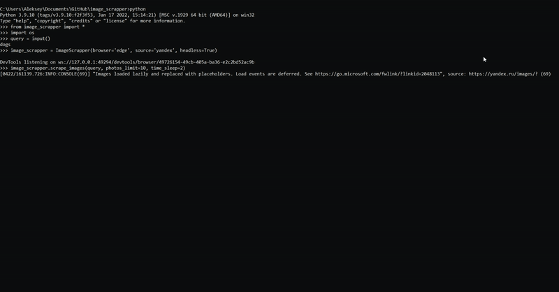

# Image Scrapper

A library to scrap images from google (low res) and yandex (high res) photos

* [Setup](#step1)
* [Usage](#step2)
* [Arguments](#step3)


<a name = "step1"></a>
# Setup
1. Open cmd (Win+R)
2. Clone the repository ([or download](https://github.com/addicted-by/image_scrapper/archive/refs/heads/main.zip))
```
git clone https://github.com/addicted-by/image_scrapper/
```
3. Install requirements
```
pip install -r requirements.txt
```
4. Run the code (like in [Usage](#step2))

<a name = "step2"></a>
# Usage
```python
from image_scrapper import *
if __name__ == "__main__":
  WEBDRIVER_PATH = "./"
  OUTPUT_PATH = "./train_data/"
  PHOTOS_TO_SCRAP = 600
  query = "cat"
  image_scrapper = ImageScrapper(webdriver_path=WEBDRIVER_PATH, browser='edge',
                    source='yandex', output_path=OUTPUT_PATH, headless=True)
  image_scrapper.scrape_images(query=query, 
                            photos_limit=PHOTOS_TO_SCRAP, time_sleep=3)
```
<a name = "step3"></a>
# Arguments
| Method | Arguments |Description |
| :---         |     :---:      |          :--- |
| `__init__` | webdriver_path=`'./'` | path to your browser webdriver (default -- current path) |
| `__init__` | browser=`{'edge', 'chrome'}` | your browser |
| `__init__` | source=`{'yandex', 'google'}` | desired search system (google for low resolution, yandex for high) |
| `__init__` | output_path=`'./'` | path to download (default will change to query string due to the emptiness) |
| `__init__` | headless=`False` | webdriver actions visibility |
| `scroll_to_bottom` | limit=`None` | | limiting the number of scrolls to the end of a page for scrapping |
| `scroll_to_bottom` | time_sleep=`3` | time.sleep value (if you have some problems with network stuff) |
| `get_tags` | query | string to scrap |
| `get_tags` | limit=`None` | limiting the number of scrolls to the end of a page for scrapping |
| `get_links` | query | string to scrap |
| `get_links` | limit=`None` | limiting the number of photos for scrapping |
| `get_links` | time_sleep=`3` | time.sleep value (if you have some problems with network stuff) |
| `scrape_images` |  query | string to scrap |
| `scrape_images` | photos_limit=`50` | limiting the number of photos for scrapping |
| `scrape_images` | scroll_limit=`None` | limiting the number of scrolls to the end of a page for scrapping |
| `scrape_images` | time_sleep=`3` | time.sleep value (if you have some problems with network stuff) |
